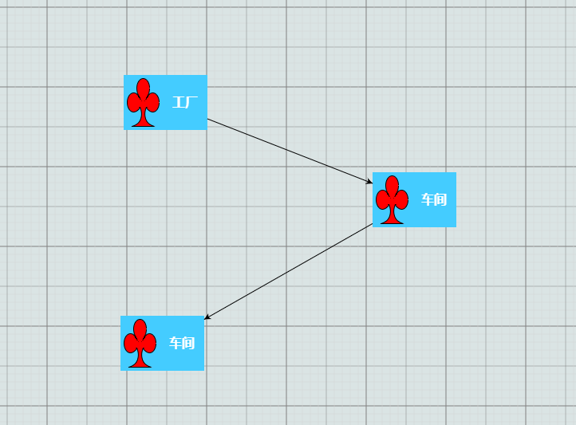

<!--
 * @Author: Fred
 * @Date: 2018-12-22 15:14:55
 * @LastEditors: Fred
 * @LastEditTime: 2018-12-22 15:22:44
 * @Description: 
 -->
# Gojs简介


`<p>GoJS是一个功能丰富的JS库，在Web浏览器和平台上可实现自定义交互图和复杂的可视化效果
，它用自定义模板和布局组件简化了节点、链接和分组等复杂的JS图表，给用户交互提供了许多先进的功能，
如拖拽、复制、粘贴、文本编辑、工具提示、上下文菜单、自动布局、模板、数据绑定和模型、事务状态和撤销管理、调色板、概述、事件处理程序、命令和自定义操作的扩展工具系统。
无需切换服务器和插件，GoJS就能实现用户互动并在浏览器中完全运行，呈现HTML5 Canvas元素或SVG，也不用服务器端请求。
 GoJS不依赖于任何JS库或框架（例如bootstrap、jquery等），可与任何HTML或JS框架配合工作，甚至可以不用框架。</p>`

## Gojs破解(go-debug.js)

```
d[D.Wg("7eba17a4ca3b1a8346")][D.Wg("78a118b7")](d,D.Qm,4,4)   替换成  function(){return true;}

```
## 示意图
